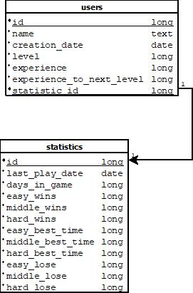
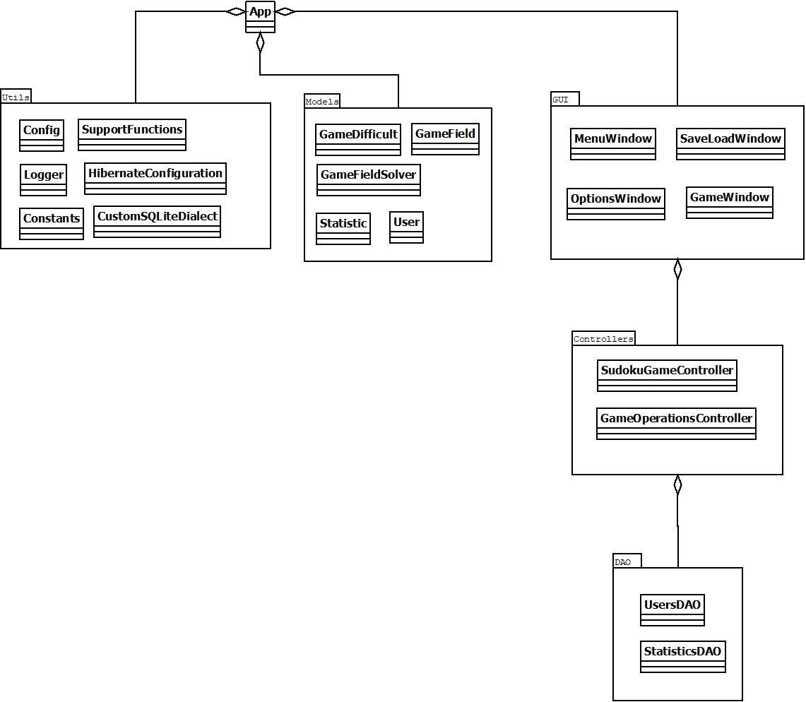

# Структура приложения ***DeusMatrix***

***

## Содержание

- [Содержание](#содержание)
- [1 - Функциональные возможности приложения](#1---функциональные-возможности-приложения)
- [2 - Выбор архитектуры приложения](#2---выбор-архитектуры-приложения)
- [3 - Выбор языка программирования](#3---выбор-языка-программирования)
- [4 - Технологии хранения данных](#4---технологии-хранения-данных)
- [5 - Набор элементов системы](#5---набор-элементов-системы)
- [6 - Схема хранения данных](#6---схема-хранения-данных)
- [7 - Перечень вспомогательных инструментов](#7---перечень-вспомогательных-инструментов)

***

## 1 - Функциональные возможности приложения

Симулятор ***DeusMatrix*** предназначен для переключения внимания с рабочих задач для повышения продуктивности.

Приложение имеет следующий функционал:

* **Генерация карт**
* **Поддержка трёх уровней сложности**
* **Поддержка вспомогательных инструментов**
* **Использование системы уровней персонажа**
* **Графический интерфейс**
* **Возможность сохранения текущего прогресса**
* **Возможность загрузки текущего прогресса**

***

## 2 - Выбор архитектуры приложения

Так как в приложении обозначена необходимость взаимодействия одного пользователей с одним хранилищем данных
и необходимость развёртывания на одной машине, в таком случае подойдёт монолитная архитектура.

***

## 3 - Выбор языка программирования

В функциональных требованиях приложения можно четко выделить бизнес сущности приложения (карта, персонаж и т.д.), потому следует использовать подходящую методологию, в данном случае это ООП (объектно-ориентированное программирование). Приложение должно быть устойчиво к смене среды исполнения (ОС). Для всех этих целей подойдет язык Java.

***

## 4 - Технологии хранения данных

Хранение информации будет осуществляться путём использования БД SQLite.

IDEF1X схема БД:

Сущности и их поля в БД:

1. **users** (пользователи)
2. **users.id** (номер пользователя, первичный ключ, тип данных long)
3. **users.name** (имя пользователя, тип данных text)
4. **users.creation_date** (дата создания пользователя, тип данных date)
5. **users.level** (уровень пользователя, тип данных long)
6. **users.experience** (опыт пользователя, тип данных long)
7. **users.experience_to_next_level** (необходимый опыт для получения следующего уровня для пользователя, тип данных long)
8. **users.statistic_id** (номер статистики пользователя, первичный ключ, внешний ключ, тип данных long)
9. **statistics** (статистика персонажа)
10. **statistics.id** (номер статистика пользователя, первичный ключ, тип данных long)
11. **statistics.last_play_date** (дата последней игры пользователя, тип данных date)
12. **statistics.days_in_game** (количество дней в игре за пользователя, тип данных long)
13. **statistics.easy_wins** (количество побед на лёгком уровне сложности, тип данных long)
14. **statistics.middle_wins** (количество побед на среднем уровне сложности, тип данных long)
15. **statistics.hard_wins** (количество побед на сложном уровне сложности, тип данных long)
16. **statistics.easy_best_time** (лучшее время игры персонажа на лёгком уровне сложности, тип данных long)
17. **statistics.middle_best_time** (лучшее время игры персонажа на среднем уровне сложности, тип данных long)
18. **statistics.hard_best_time** (лучшее время игры персонажа на сложном уровне сложности, тип данных long)
19. **statistics.easy_lose** (количество поражений на лёгком уровне сложности, тип данных long)
20. **statistics.middle_lose** (количество поражений на среднем уровне сложности, тип данных long)
21. **statistics.hard_lose** (количество поражений на сложном уровне сложности, тип данных long)

## 5 - Набор элементов системы

UML схема приложения:

Элементы системы:

1. **App** (точка входа в программу)
2. **Utils** (вспомогательные классы)
3. **Utils.Config** (класс предоставляющий доступ и реализующий конфигурацию приложения)
4. **Utils.Logger** (класс для журналирования событий приложения)
5. **Utils.Constants** (класс с константами приложения)
6. **Utils.SupportFunctions** (класс со вспомогательными функциями)
7. **Utils.HibernateConfiguration** (класс предоставляющий доступ и реализующий конфигурацию БД приложения)
8. **Utils.CustomSQLiteDialect** (класс реализующий диалект СУБД SQLite для Hibernate)
9. **Models** (модели приложения)
10. **Models.GameDifficult** (перечисление реализующее сложность игры)
11. **Models.GameField** (класс реализующий игровое поле для судоку)
12. **Models.GameFieldSolver** (класс реализующий логику решения судоку)
13. **Models.Statistic** (класс реализующий статистику пользователя)
14. **Models.User** (класс реализующий пользователя)
15. **GUI** (графический интерфейс приложения)
16. **GUI.MenuWindow** (окно меню приложения)
17. **GUI.SaveLoadWindow** (окно сохранения/загрузки приложения)
18. **GUI.OptionsWindow** (окно настроек приложения)
19. **GUI.GameWindow** (игровое окно приложения)
20. **Controllers** (классы с бизнес логикой приложения)
21. **Controllers.SudokuGameController** (бизнес логика игры)
22. **Controllers.GameOperationsController** (бизнес логика сохранения, загрузки и настройки игры)
23. **DAO** (классы с логикой доступа к данным)
24. **GUI.UsersDAO** (класс с логикой доступа к данным пользователей)
25. **GUI.StatisticsDAO** (класс с логикой доступа к данным статистики игр)

***

## 6 - Схема хранения данных

В приложении осуществляется хранение данных о последнем игровом процессе и игровой статистике персонажа, новые элементы игрового процесса получаются путём процедурной генерации.

Имеется поддержка и загрузка сохранений из файлов специального формата.

***

## 7 - Перечень вспомогательных инструментов

Ниже приведён перечень вспомогательных инструментов, которые использовались при разработке приложения.

Инструменты для разработки:

* **Eclipse / NetBeans / IDEA (среда разработки)**
* **Maven / Gradle (сборщик проектов)**
* **JDK**
* **Notepad++**
* **SQLiteDatabaseBrowserPortable**
* **WindowsPowerShell**

Библиотеки:

* **Hibernate**
* **Launch4J**
* **SWING**
* **FlatLAF**
* **Google Simple JSON**